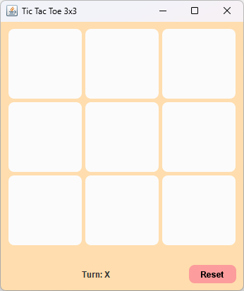

# 🎮 Tic Tac Toe 3x3 (Java Swing)

Một trò chơi Tic Tac Toe 3x3 (Caro mini) được xây dựng bằng **Java Swing**, sử dụng **OOP (Lập trình hướng đối tượng)**.  
Giao diện có hiệu ứng bo góc, màu sắc tùy chỉnh và thông báo chiến thắng sinh động 💫  

---

## ✨ Tính năng nổi bật

- 🧩 **Giao diện bo tròn đẹp mắt** (Rounded Button)
- 🎨 **Tùy chỉnh màu sắc** (nút, nền, trạng thái thắng)
- 💡 **Kiến trúc tách lớp rõ ràng:**
  - `TicTacToeUI.java`: giao diện người dùng
  - `TicTacToeGame.java`: xử lý logic game (lượt đi, thắng/thua/hòa)
  - `TicTacToeChecker.java`: kiểm tra điều kiện thắng
  - `RoundedButton.java`: lớp tùy chỉnh cho nút bo tròn
- 🏆 **Highlight ô thắng** (tô màu khi người chơi thắng)
- 🔁 **Reset game nhanh chóng**
- ⚙️ Dễ mở rộng & thêm hiệu ứng animation!

---

## 🧱 Cấu trúc thư mục

```
📂 TicTacToe/
 ├── TicTacToeUI.java         # Giao diện chính (UI)
 ├── TicTacToeGame.java       # Xử lý logic trò chơi
 ├── TicTacToeChecker.java    # Kiểm tra thắng/thua
 ├── RoundedButton.java       # Nút bo tròn có hiệu ứng hover
 └── README.md                # File mô tả dự án
```

---

## 🚀 Cách chạy chương trình

### ✅ Yêu cầu
- Java JDK 8 trở lên
- IDE (khuyên dùng): IntelliJ IDEA, Eclipse, NetBeans

### ▶️ Chạy chương trình
1. Mở project trong IDE
2. Chạy file:
   ```bash
   TicTacToeUI.java
   ```
3. Giao diện sẽ hiện ra và bạn có thể bắt đầu chơi ngay 🎉

---

## 🧠 Hướng dẫn chơi
- Hai người chơi lần lượt nhấn vào ô trống để đánh dấu (`X` hoặc `O`)
- Ai tạo được một hàng, cột, hoặc đường chéo gồm 3 ký hiệu của mình trước sẽ thắng 🏅
- Khi ván kết thúc, nhấn **Reset** để bắt đầu lại

---

## 💻 Áp dụng OOP trong dự án

| Tính chất | Mô tả |
|------------|--------|
| **Đóng gói (Encapsulation)** | Dữ liệu game (bảng, lượt đi, trạng thái) được bảo vệ trong `TicTacToeGame` |
| **Kế thừa (Inheritance)** | `TicTacToeUI` kế thừa từ `JFrame` |
| **Đa hình (Polymorphism)** | Ghi đè `paintComponent()` trong `RoundedButton` |
| **Trừu tượng (Abstraction)** | Chia tách lớp `Checker` và `Game` để xử lý logic riêng biệt |

---

## 🧁 Hình minh họa giao diện
> 🎨 Giao diện Tic Tac Toe 3x3 với hiệu ứng bo tròn và màu sắc nhẹ nhàng:



---

## ❤️ Tác giả
👩‍💻 **Poppy** – Sinh viên yêu thích Genshin Impact và lập trình 🎮  
> “Mỗi dòng code là một bước phiêu lưu mới!”

---

## 📜 Giấy phép
Dự án này được phát hành theo giấy phép MIT License.  
Bạn có thể tự do sử dụng, chỉnh sửa và chia sẻ lại miễn là ghi nguồn. 🌸
